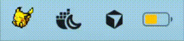
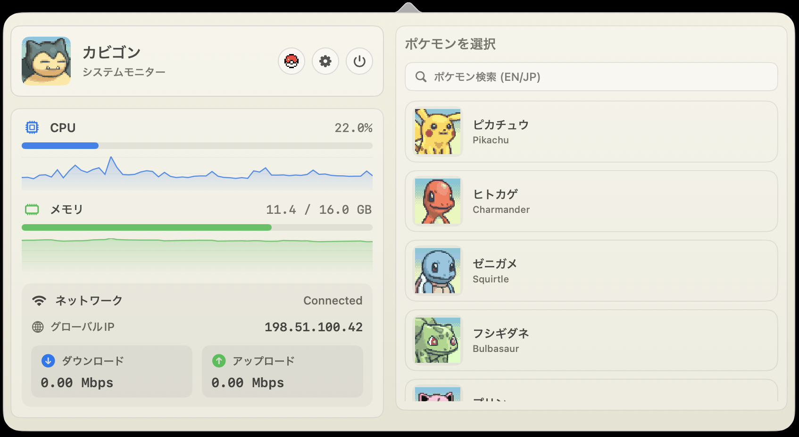

# PokeBar


<div align="center">
  <h3>ポケモン風の macOS メニューバー システムモニター</h3>
  <p>メニューバーで眠るポケモン、ポップオーバーで CPU / メモリ / ネットワークを表示。</p>
  
</div>

English README: [README.md](README.md)

**Homebrew:**

```bash
brew install --cask keshav-k3/tap/pokebar
```

**直接ダウンロード:** [最新リリース](https://github.com/keshav-k3/PokeBar/releases/latest)

**現在対応しているポケモン:** ピカチュウ、ヒトカゲ、ゼニガメ、フシギダネ、プリン、コダック、イーブイ、ミジュマル、カイリュー、カビゴン

<div align="center">
  <h3>ポケモンを選ぶ</h3>
  <table>
    <tr>
      <td valign="top"></td>
    </tr>
  </table>
</div>

**macOS で「壊れている」または開けない場合:** PokeBar は Apple Notarization 未対応です。インストール後に一度だけ隔離属性を解除してください。

```bash
xattr -dr com.apple.quarantine /Applications/PokeBar.app
```

初回起動時は `PokeBar.app` を **右クリック → 開く** でも回避できる場合があります。
