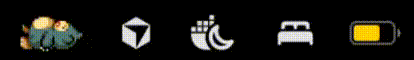
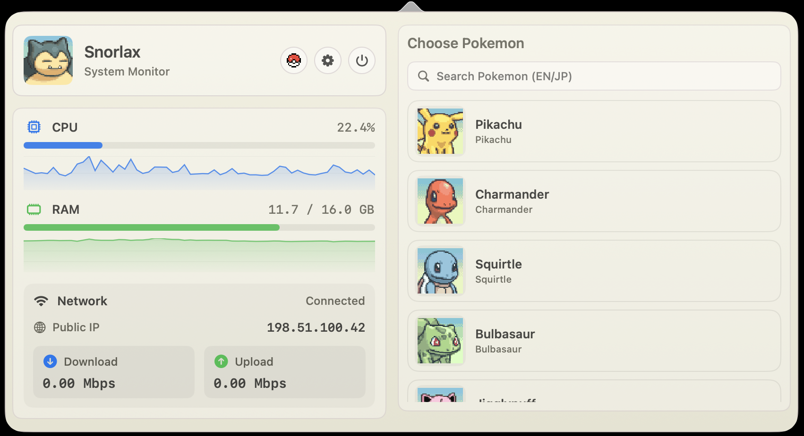

# PokeBar

<p align="center">
  
  
</p>

<div align="center">
  <h3>Pokémon-themed macOS menu bar system monitor</h3>
  <p>Sleeping Pokémon in the menu bar; CPU, RAM, and Network stats in the popover.</p>
  
</div>

日本語 [README.ja.md](README.ja.md)

**License:** The **program source code** in this repository is under the [MIT License](LICENSE) (see the MIT section at the top of that file). **Bundled sprite images** are **not** MIT-licensed; they follow **third-party terms** (including [CC BY-NC 4.0](https://creativecommons.org/licenses/by-nc/4.0/) where stated for PMD Collab–sourced assets). See [`LICENSE`](LICENSE), [`THIRD_PARTY_NOTICES.md`](THIRD_PARTY_NOTICES.md), and [PMD Collab About](https://sprites.pmdcollab.org/#/About). Pokémon is a trademark of Nintendo / Game Freak / The Pokémon Company; this is a fan project and is not affiliated with them.

**Homebrew:**

```bash
brew install --cask keshav-k3/tap/pokebar
```

**Direct download:** [latest release](https://github.com/keshav-k3/PokeBar/releases/latest)

**Currently supported Pokemon:** Pikachu, Charmander, Squirtle, Bulbasaur, Jigglypuff, Psyduck, Eevee, Oshawott, Dragonite, Snorlax

<div align="center">
  <h3>Choose your Pokemon</h3>
  <table>
    <tr>
      <td valign="top"></td>
    </tr>
  </table>
</div>

**macOS “damaged” or won’t open:** PokeBar is not Apple-notarized. After install, clear quarantine once:

```bash
xattr -dr com.apple.quarantine /Applications/PokeBar.app
```

You can also try **right-click → Open** on `PokeBar.app` the first time.
