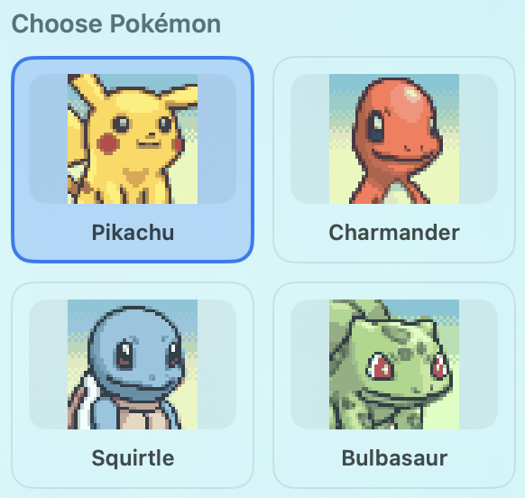
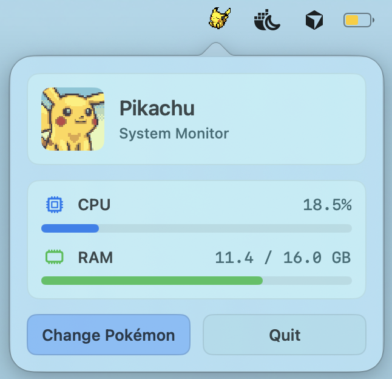

# PokeBar

<div align="center">
  <h3>Pokémon-themed macOS menu bar system monitor</h3>
  <p>Sleeping Pokémon in the menu bar; CPU and RAM in the popover.</p>
  
</div>

**Homebrew:**

```bash
brew install --cask keshav-k3/tap/pokebar
```

**Direct download:** [latest release](https://github.com/keshav-k3/PokeBar/releases/latest)

<div align="center">
  <h3>Choose your Pokemon</h3>
  <table>
    <tr>
      <td valign="top"></td>
      <td valign="middle">&nbsp;👉&nbsp;</td>
      <td valign="top"></td>
    </tr>
  </table>
</div>
